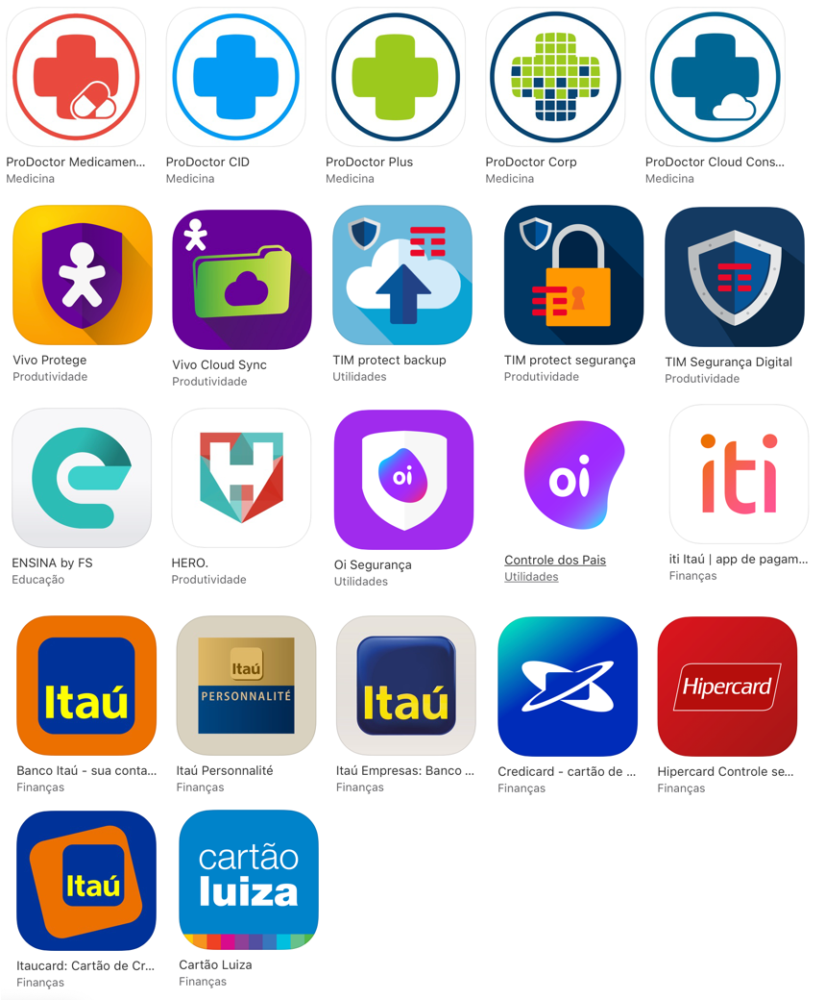
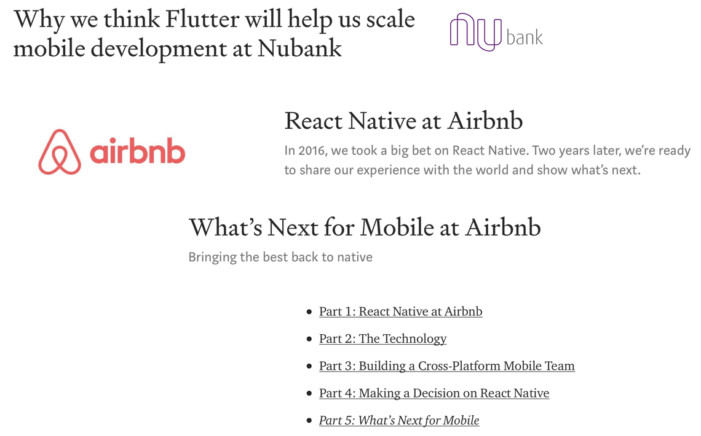

# Desenvolvimento `mobile`

---

## Apresentação
- Fábio Nogueira de Almeida
- Vinicius

## Tópicos
- Desenvolvimento Mobile
- Desenvolvimento no Itaú Unibanco
- Comunidade

---

## Fábio Nogueira de Almeida

- ProDoctor
- Concrete 
- FS Security
- Itaú Unibanco 

---

## Vinicius

---

# Desenvolvimento Nativo

---

# Desenvolvimento Nativo

`Apple`
- Objective C
- Swift

`Android`
- Java
- Kotlin

---

# Desenvolvimento Nativo

## Prós
- Interface
- Experiência do usuário
- Performance
- Rapidez na implementação das novas tecnologias
- Plataforma mais madura

---

# Desenvolvimento Nativo

## Contras

- Tempo de aprendizado da linguagem e frameworks 
- Custo
- Prazo

---

# Desenvolvimento Híbrido

---

# Desenvolvimento Híbrido 

- Web
- Compilado

---

# Desenvolvimento Híbrido

## Web
- Ionic
- PhoneGap

## Compilado

- React Native (Facebook)
- Flutter (Google)

---

# Desenvolvimento Híbrido

## Prós

- Único código fonte
- Time reduzido

---

# Desenvolvimento Híbrido

## Contras
- Limitações de performance e funcionalidades
- Necessidade do conhecimento das plataformas nativas
- Enterprise Early adopted

---

# Desenvolvimento Híbrido

## Curiosidades

---

# `Itaú Unibanco`

---

# `Itaú Unibanco`

- Consultoria
- Time Autenticação

---

# `Itaú Unibanco`
## Tempos de Consultoria

---

# `Itaú Unibanco`
## Tempos de consultoria

- Time 60+
- 10 +- iOS
- 10 +- Android
- Metodologias Ágeis: Kanban, Scrum e Nexus

----

# `Itaú Unibanco`
## Tempos de consultoria

- Node.js
- Java
- Migrações
	- Kony -> Objective e Java  
	- Objective C -> Swift
	- Java -> Kotlin

---

# `Itaú Unibanco`
## Time Autenticação

---

# `Itaú Unibanco`
## Time Autenticação

- Time 100+
- 11 squads
- Objective C, Swift, Java, Kotlin, C#, Cobal
- Modularização

---

# Comunidade

---

# Desafios

---

# Desafios

- Inglês
- Testes unitários
- Acessibilidade
- Metodologias ágeis

---

# Dicas

---

# Dicas

- Slack Juiz de Fora (https://devjf.herokuapp.com)
- Slack iOS e Android BR
- Curso de Stanford iOS (iTunes e YouTube )
- Ray Wenderlich (Site/blog)
- www.itau.com.br/carreira

---

# Contatos

- Fábio Nogueira
	- Twitter: @fabintk
	- fna.contact@gmail.com

---